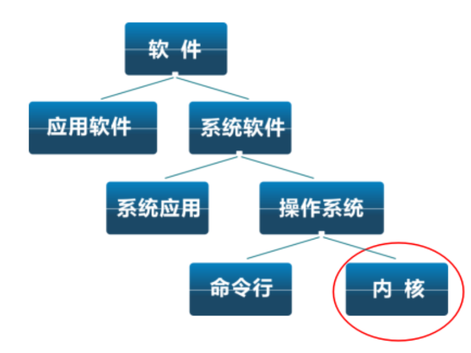
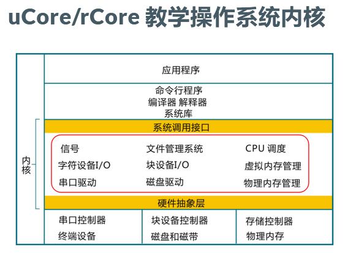

### 目录

- 操作系统定义
- 操作系统是什么
- 操作系统在软件体系中的位置
- uCore/rCore 教学操作系统

### 操作系统定义

操作系统是管理统筹硬件设备，为上层软件系统提供支持，改善人机关系的一种系统软件。

### 操作系统是什么

是一个控制程序

- 一个系统软件
- 负责执行其他程序的程序
- 负责控制其他程序的执行
- 能方便用户使用计算机

是一个资源管理程序

- 是应用于硬件直接的中间层
- 管理各种软硬件资源
- 访问软硬件资源的服务
- 解决访问冲突，确保计算机系统的公平使用(包括用户对计算机资源的使用和程序对资源的使用等)

### 操作系统在软件体系中的位置

Shell - 命令行接口
GUI - 图形用户接口
Kernel - 操作系统内核

### uCore/rCore 教学操作系统

#### 是什么
uCore/rCore 是清华大学开发的教学用操作系统内核
其中 uCore 是基于 `C语言` 实现的，而 rCore 是基于 `Rust` 实现的

#### 内核架构图

