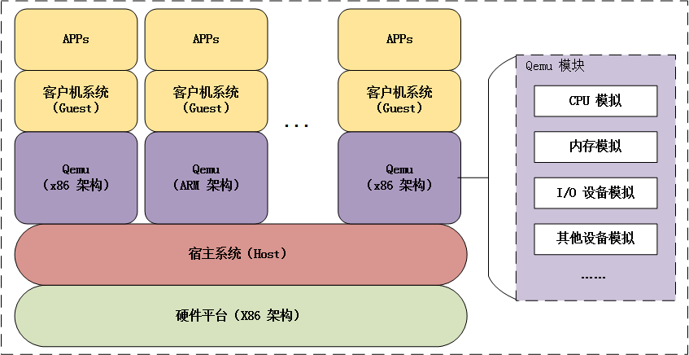

### Qemu
> Qemu 是纯软件实现的虚拟化模拟器，几乎可以模拟任何硬件设备，我们最熟悉的就是能够模拟一台能够独立运行操作系统的虚拟机，虚拟机认为自己和硬件打交道，但其实是和 Qemu 模拟出来的硬件打交道，Qemu 将这些指令转译给真正的硬件。

##### 参考资料：
https://zhuanlan.zhihu.com/p/72484589

### RISC-V 常见指令

算术运算

add rd, rs1, rs2

x[rd] = x[rs1] + x[rs2]

把寄存器 x[rs2]加到寄存器 x[rs1]上，结果写入 x[rd]。忽略算术溢出。

 

addi rd, rs1, immediate

x[rd] = x[rs1] + sext(immediate)

把符号位扩展的立即数加到寄存器 x[rs1]上，结果写入 x[rd]。忽略算术溢出。

 

sub rd, rs1, rs2

x[rd] = x[rs1] − x[rs2]

x[rs1]减去 x[rs2]，结果写入 x[rd]。忽略算术溢出。

 

div rd, rs1, rs2

x[rd] = x[rs1] ÷s x[rs2]

用寄存器 x[rs1]的值除以寄存器 x[rs2]的值，向零舍入，将这些数视为二进制补码，把商写 入 x[rd]。

 

mul rd, rs1, rs2

x[rd] = x[rs1] × x[rs2]

把寄存器 x[rs2]乘到寄存器 x[rs1]上，乘积写入 x[rd]。忽略算术溢出。

 

rem rd, rs1, rs2

x[rd] = x[rs1] %𝑠 x[rs2]

求余数。x[rs1]除以 x[rs2]，向 0 舍入，都视为 2 的补码，余数写入 x[rd]。

 

neg rd, rs2

x[rd] = −x[rs2]

把寄存器 x[rs2]的二进制补码写入 x[rd]。

 

逻辑运算

and rd, rs1, rs2

x[rd] = x[rs1] & x[rs2]

将寄存器 x[rs1]和寄存器 x[rs2]位与的结果写入 x[rd]。

 

andi  rd, rs1, immediate

x[rd] = x[rs1] & sext(immediate)

把符号位扩展的立即数和寄存器 x[rs1]上的值进行位与，结果写入 x[rd]。

 

or rd, rs1, rs2

x[rd] = ~x[rs1]

把寄存器 x[rs1]和寄存器 x[rs2]按位取或，结果写入 x[rd]。

 

xor rd, rs1, immediate

x[rd] = x[rs1] ^ sext(immediate)

x[rs1]和有符号扩展的 immediate 按位异或，结果写入 x[rd]。

 

位运算

sll rd, rs1, rs2

x[rd] = x[rs1] ≪ x[rs2]

逻辑左移（空位补0）

 

slli rd, rs1, shamt

立即数逻辑左移

 

srl rd, rs1, rs2

x[rd] = (x[rs1] ≫𝑢 x[rs2])

逻辑右移（空位补0）

 

srli rd, rs1, shamt

立即数逻辑右移

 

sra rd, rs1, rs2

x[rd] = (x[rs1] ≫𝑠 x[rs2])

算术右移（空位用最高位填充）

 

srai rd, rs1, shamt

立即数逻辑右移

 

not td, rs1

x[rd] = ~x[rs1]

把寄存器 x[rs1]对于 1 的补码（即按位取反的值）写入 x[rd]。实际被扩展为 xori rd, rs1, -1。

 

条件控制指令

beq rs1, rs2, offset

if (rs1 == rs2) pc += sext(offset)

若寄存器 x[rs1]和寄存器 x[rs2]的值相等，把 pc 的值设为当前值加上符号位扩展的偏移 offset。

 

bge rs1, rs2, offset

if (rs1 ≥s rs2) pc += sext(offset)

若寄存器 x[rs1]的值大于等于寄存器 x[rs2]的值（均视为二进制补码），把 pc 的值设为当前 值加上符号位扩展的偏移 offset。

 

blt rs1, rs2, offset

if (rs1 <s rs2) pc += sext(offset)

若寄存器 x[rs1]的值小于寄存器 x[rs2]的值（均视为二进制补码），把 pc 的值设为当前值加 上符号位扩展的偏移 offset。

 

bne rs1, rs2, offset

if (rs1 ≠ rs2) pc += sext(offset)

若寄存器 x[rs1]和寄存器 x[rs2]的值不相等，把 pc 的值设为当前值加上符号位扩展的偏移 offset。

 

跳转指令

j offset

pc += sext(offset)

把 pc 设置为当前值加上符号位扩展的 offset，等同于 jal x0, offset。

 

jal rd, offset

x[rd] = pc+4; pc += sext(offset)

把下一条指令的地址 (pc+4)，然后把 pc 设置为当前值加上符号位扩展的offset。rd 默认为 x1。 

 

jr rs1

pc = x[rs1]

把 pc 设置为 x[rs1]，等同于 jalr x0, 0(rs1)。

 

jalr rd, offset(rs1)

t = pc+4; pc =(x[rs1]+sext(offset))&~1; x[rd]= t

把 pc 设置为 x[rs1] + sign-extend(offset)，把计算出的地址的最低有效位设为 0，并将原 pc+4 的值写入 f[rd]。rd 默认为 x1。

 

ret 

pc = x[1]

从子过程返回。实际被扩展为 jalr x0, 0(x1)。

 

加载与存储指令

la rd, symbol

x[rd] = &symbol

将 symbol 的地址加载到 x[rd]中。

 

li rd, immediate

x[rd] = immediate

将常量加载到 x[rd]中。

 

lw rd, offset(rs1)

x[rd] = sext(M[x[rs1] + sext(offset)][31:0])

从地址 x[rs1] + sign-extend(offset)读取四个字节，写入 x[rd]。

 

sw rs2, offset(rs1)

M[x[rs1] + sext(offset) = x[rs2][31: 0]

将 x[rs2]的低位 4 个字节存入内存地址 x[rs1]+sign-extend(offset)。

摘自[博客园](https://www.cnblogs.com/truelycloud/p/10807398.html)