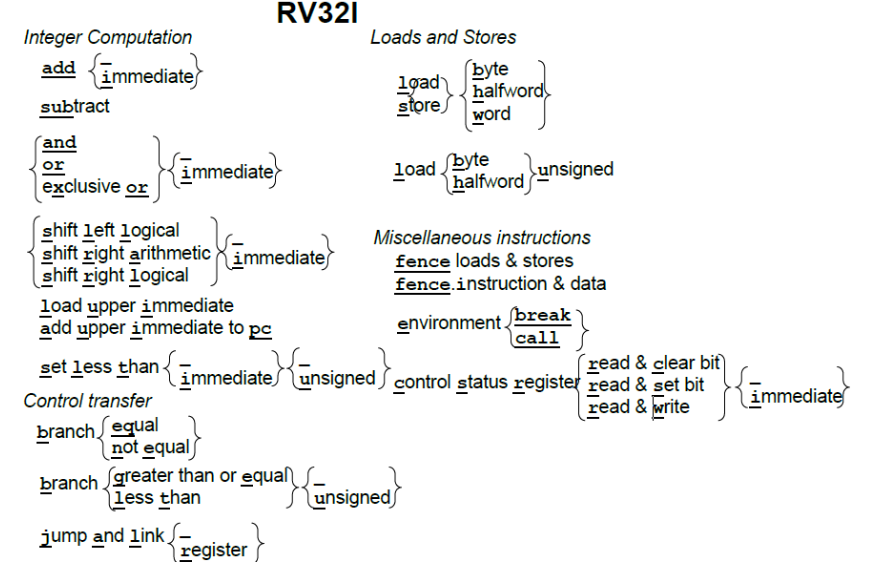

### RV32I

RV32I 是基础整数指令集

### 指令格式

*共六种，均为 32 位长*

R型指令：用于寄存器-寄存器操作

I型指令：用于短立即数和访存 load 操作

S型指令：用于访存 store 操作

B型指令：用于条件跳转操作

U型指令：用于长立即数

J型指令：用于无条件跳转

### 寄存器

RV32I 有 31 个寄存器和 1 个恒为 0 的 x0 寄存器，增强简洁性

*均占 32 位 0-31*

| RV32I 寄存器 | 对应其他常见寄存器 | 用途                                                         |
| ------------ | ------------------ | ------------------------------------------------------------ |
| x0           | zero               | Hardwired zero 硬件层面恒为 0                                |
| x1           | ra                 | Return Addr 返回地址                                         |
| x2           | sp                 | Stack pointer 栈指针                                         |
| x3           | gp                 | Global pointer 全局指针（？                                  |
| x4           | tp                 | Thread pointer 线程指针（？                                  |
| x5           | t0                 | Temporary 临时寄存器                                         |
| x6           | t1                 | Temporary 临时寄存器                                         |
| x7           | t2                 | Temporary 临时寄存器                                         |
| x8           | s0 / fp            | Saved register 保存寄存器, frame pointer 用于访问堆栈帧中的**自动变量**，即**局部作用域变量**（？ |
| x9           | s1                 | Saved register 保存寄存器                                    |
| x10          | a0                 | Function argument, return value 函数参数，返回值             |
| x11          | a1                 | Function argument, return value 函数参数，返回值             |
| x12          | a2                 | Function argument 函数参数                                   |
| x13          | a3                 | Function argument 函数参数                                   |
| x14          | a4                 | Function argument 函数参数                                   |
| x15          | a5                 | Function argument 函数参数                                   |
| x16          | a6                 | Function argument 函数参数                                   |
| x17          | a7                 | Function argument 函数参数                                   |
| x18          | s2                 | Saved register 保存寄存器                                    |
| x19          | s3                 | Saved register 保存寄存器                                    |
| x20          | s4                 | Saved register 保存寄存器                                    |
| x21          | s5                 | Saved register 保存寄存器                                    |
| x22          | s6                 | Saved register 保存寄存器                                    |
| x23          | s7                 | Saved register 保存寄存器                                    |
| x24          | s8                 | Saved register 保存寄存器                                    |
| x25          | s9                 | Saved register 保存寄存器                                    |
| x26          | s10                | Saved register 保存寄存器                                    |
| x27          | s11                | Saved register 保存寄存器                                    |
| x28          | t3                 | Temporary 临时寄存器                                         |
| x29          | t4                 | Temporary 临时寄存器                                         |
| x30          | t5                 | Temporary 临时寄存器                                         |
| x31          | t6                 | Temporary 临时寄存器                                         |

| pc 寄存器 |
| --------- |

> RISC-V 有足够多的寄存器来达到两全其美的结果：既能将操作数存放在寄存器中，同时也能减少保存和恢复寄存器的次数。其中的关键在于，在函数调用的过程中不保留部分寄存器存储的值，称它们为临时寄存器；另一些寄存器则对应地称为保存寄存器。

